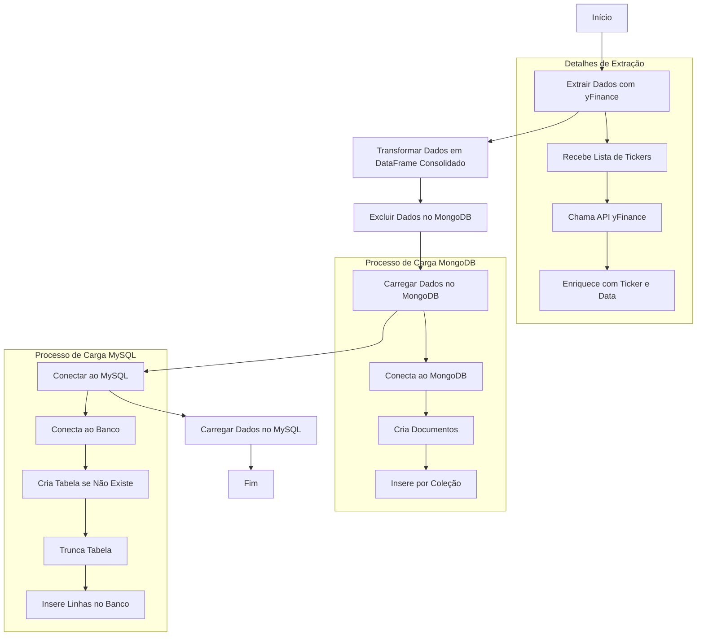

# Script de Integração e Transformação de Dados com Yahoo Finance, MongoDB e MySQL

## Descrição Geral

Este script realiza a extração de dados históricos de ações da API do Yahoo Finance, transformação e carregamento dos dados para bancos de dados MongoDB e MySQL. Ele é dividido em várias funções modulares que implementam o processo ETL (Extração, Transformação e Carregamento).

## Bibliotecas Utilizadas

- `pymongo`: Conecta-se ao MongoDB para operações de leitura e escrita.
- `dotenv`: Carrega variáveis de ambiente de um arquivo .env.
- `os`: Manipula caminhos e acessa variáveis do ambiente.
- `yfinance`: Extrai dados financeiros do Yahoo Finance.
- `pandas`: Manipula e transforma os dados extraídos.
- `pyodbc`: Conecta-se a bancos de dados via ODBC.
- `logging`: Registra logs de eventos e erros durante a execução.
- `datetime`: Manipula datas.
- `typing`: Define tipos para argumentos e retornos das funções.

## Estrutura do Script

### 1. Configuração de Logging

O sistema de logs registra eventos e erros em um arquivo localizado em um caminho especificado pela variável de ambiente `LOG_PATH`. O nome do arquivo inclui a data atual no formato `log_main_DIA_MES_ANO.log`.

```bash
logging.basicConfig(
    level=logging.INFO,
    format="%(asctime)s - %(levelname)s - %(message)s",
    filename=os.path.join(log_path, f"log_main_{day}_{month}_{year}.log"),
    filemode="a",
)
```

### 2. Funções do Script

#### 2.1. extract_data_yfinance

Extrai dados históricos de ações para uma lista de tickers fornecidos.

Entradas:

- `ticker_list` (List): Lista de tickers.
- `start_data` (str): Data inicial no formato `YYYY-MM-DD`.
- `end_data` (str): Data final no formato `YYYY-MM-DD`.

Saída:

- Uma lista de DataFrames contendo os dados históricos para cada ticker, ou `None` em caso de erro.

#### 2.2. transform_dataframe

Consolida uma lista de DataFrames em um único DataFrame.

Entrada:

- `df_list` (List): Lista de DataFrames a serem concatenados.

Saída:

- `DataFrame` consolidado ou `None` caso a lista esteja vazia.

#### 2.3. connect_to_mongo

Estabelece conexão com um banco de dados MongoDB.

Entradas:

- `uri` (str): URI de conexão para o MongoDB.
- `database` (str): Nome do banco de dados.

Saída:

- Objeto `Database` representando o banco conectado.

#### 2.4. delete_data_from_mongo

Remove todas as coleções de um banco de dados MongoDB.

Entrada:

- `database` (str): Nome do banco de dados MongoDB.

Saída:

- Nenhuma. Mensagens de sucesso ou erro são registradas nos logs.

#### 2.5. load_to_mongo

Carrega dados de um DataFrame para um banco MongoDB.

Entradas:

- `dataframe` (pd.DataFrame): Dados a serem carregados.
- `database` (str): Nome do banco.
- `uri` (str): URI de conexão.

Saída:

- Nenhuma. Cria coleções separadas para cada ticker no MongoDB.

#### 2.6. connect_to_mysql

Conecta-se a um banco de dados MySQL usando pyodbc.

Entradas:

- `driver` (str): Driver ODBC.
- `server` (str): Endereço ou nome do servidor.
- `db` (str): Nome do banco.
- `user` (str): Nome do usuário.
- `password` (str): Senha do usuário.

Saída:

- Objeto de conexão pyodbc.Connection.

#### 2.7. load_to_mysql

Carrega dados de um DataFrame em uma tabela MySQL.

Entradas:

- `con` (pyodbc.Connection): Objeto de conexão com MySQL.
- `dataframe` (pd.DataFrame): Dados a serem carregados.

Saída:

- Nenhuma. Cria a tabela tbl_historico_acoes e insere os dados.

#### 2.8. main

Função principal que coordena todas as etapas do processo ETL.

Entradas:

- `tickers` (List): Lista de tickers.
- `start_data` (str): Data inicial.
- `end_data` (str): Data final.

Fluxo:

1. Extrai dados de ações.
2. Remove dados antigos do MongoDB.
3. Transforma os dados em um DataFrame consolidado.
4. Carrega os dados no MongoDB.
5. Carrega os dados no MySQL.



### 3. Variáveis de Ambiente Utilizadas

- `LOG_PATH`: Caminho para salvar os logs.
- `MYSQL_DRIVER`, `MYSQL_SERVER`, `MYSQL_DATABASE`, `MYSQL_USERNAME`, `MYSQL_PASSWORD`: Credenciais e parâmetros do MySQL.
- `MONGO_URI`, `MONGO_DATABASE`: URI e banco de dados MongoDB.

### 4. Execução

A execução é iniciada no bloco if `__name__ == "__main__":`. Uma lista predefinida de tickers é passada para a função main junto com um intervalo de datas.

### 5. Exemplo de Uso

```bash
python script.py
```

### 6. Notas Adicionais

- Certifique-se de que o arquivo .env contenha todas as variáveis necessárias.
- Instale as bibliotecas requeridas usando pip install -r requirements.txt.
