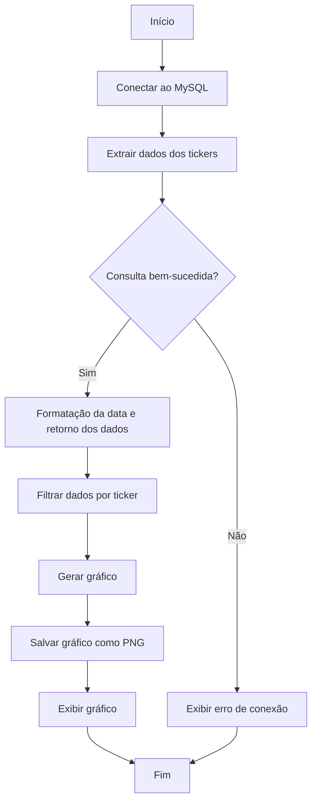

# Script de Extração e Visualização de Dados de Ações do MySQL

## Descrição Geral

Este script realiza a extração de dados históricos de ações armazenados em um banco de dados MySQL, além de gerar gráficos comparativos entre duas ações específicas ao longo do tempo. Os gráficos são salvos como imagens no formato PNG em uma pasta configurada.

## Bibliotecas Utilizadas

- `pandas`: Manipula e transforma os dados extraídos.
- `matplotlib.pyplot`: Cria os gráficos comparativos.
- `matplotlib.dates`: Formata os eixos de tempo nos gráficos.
- `main`: Fornece a função connect_to_mysql para conexão ao MySQL.
- `pyodbc.Connection`: Representa a conexão com o banco de dados MySQL.
- `os`: Manipula caminhos de arquivos e acessa variáveis de ambiente.
- `warnings`: Filtra avisos desnecessários.
- `typing`: Define tipos para argumentos e retornos das funções.

## Estrutura do Script

### 1. Funções do Script

#### 1.1. `extract_data_from_mysql`

Extrai dados históricos de ações do banco de dados MySQL para os tickers fornecidos.

Entradas:

- `first_ticker` (str): O ticker da primeira ação.
- `second_ticker` (str): O ticker da segunda ação.
- `con` (pyodbc.Connection): Conexão ativa com o banco de dados MySQL.

Saída:

Uma tupla contendo:

- `pd.DataFrame`: Dados históricos das ações.
- `str`: Nome do primeiro ticker.
- `str`: Nome do segundo ticker.

Notas:

A coluna de data é formatada no tipo datetime para facilitar a manipulação.

#### 1.2. plot_graph

Gera um gráfico comparativo entre duas ações e salva a imagem em uma pasta especificada.

Entradas:

- `first_ticker` (str): O ticker da primeira ação.
- `second_ticker` (str): O ticker da segunda ação.
- `folder_to_save` (str): Caminho da pasta onde o gráfico será salvo.
- `con` (pyodbc.Connection): Conexão ativa com o banco de dados MySQL.

Saída:

- Nenhuma. O gráfico é salvo como um arquivo PNG no caminho especificado.

Notas:

O gráfico utiliza uma grade suave e é formatado para exibir os anos no eixo X.

### 2. Configuração de Conexão e Caminhos

O script utiliza variáveis de ambiente para configurar os parâmetros de conexão ao banco de dados MySQL e o caminho para salvar os gráficos.

<strong> Variáveis de Ambiente Utilizadas </strong> :

- `MYSQL_DRIVER`: Driver ODBC para conexão ao MySQL.
- `MYSQL_SERVER`: Endereço do servidor MySQL.
- `MYSQL_DATABASE`: Nome do banco de dados.
- `MYSQL_USERNAME`: Nome do usuário.
- `MYSQL_PASSWORD`: Senha do usuário.
- `IMG_PATH`: Caminho para salvar os gráficos.

### 3. Execução

A execução inicia no bloco if `__name__ == "__main__":`. Os tickers das ações a serem comparadas e o intervalo de datas são definidos diretamente no código.

Fluxo de Execução:

1. Estabelece uma conexão com o banco de dados MySQL.
2. Extrai os dados históricos para os tickers fornecidos.
3. Gera um gráfico comparativo entre as duas ações.
4. Salva o gráfico como um arquivo PNG na pasta especificada.



### 4. Exemplo de Uso

```bash
python script.py
```

Nota: Certifique-se de que todas as variáveis de ambiente necessárias estão configuradas antes de executar o script.

### 5. Notas Adicionais

- O script depende de uma conexão MySQL ativa e funcional.
- As tabelas no banco de dados devem conter pelo menos as colunas ticker, data e close.
- O gráfico é salvo em alta qualidade (300 DPI) para uso em apresentações e relatórios.
- Caso haja erros na conexão ou extração, mensagens de erro serão exibidas no console.
